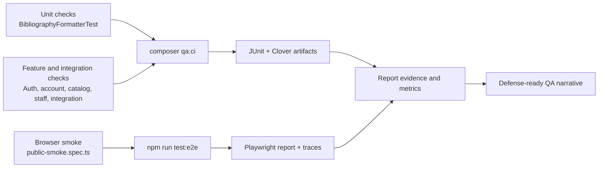

# Final QA Report — Empirical Verification and Defense-Ready Analysis for the КазТБУ Digital Library

## Status snapshot
- **Repository:** `almazmurat/digital-library`
- **Verification date:** 2026-04-11
- **Local baseline:** `composer qa:ci` → **139 passed / 595 assertions**; `npm run test:e2e` → **3 passed (4.7s)**
- **Remote baseline:** the latest `Continuous Verification` run on `main` was confirmed green during the final hardening cycle

---

## Abstract
This report evaluates the quality-assurance maturity of the КазТБУ Digital Library, a Laravel-, PostgreSQL-, and Vite-based university library platform that includes public discovery, authenticated reader services, internal staff operations, and bounded integration APIs. The work was conducted as an empirical QA study of a live repository, using **PHPUnit**, **Playwright**, **Clover/JUnit reporting**, and **GitHub Actions** to collect repeatable verification evidence rather than relying on narrative claims alone.

The resulting dataset combined local gate logs, browser-smoke results, coverage artifacts, metrics charts, and recent clean-runner workflow history. Those sources show that the project is strongest in the areas with the highest operational risk: authentication, reader account access, internal staff boundaries, catalog discovery, and integration safety. The most important observed failures were not purely business-logic defects; they were failures of **environment normalization and detectability**, including locale-sensitive assertions, missing frontend tooling on clean runners, and artifact-permission drift in browser verification.

The report therefore interprets QA outcomes through two complementary coverage dimensions. **Global line coverage** from Clover remains intentionally low because the defended suite is measured against the full application namespace, while **high-risk scenario coverage** is much stronger and more informative for the platform’s critical path. The final conclusion is not that the repository is exhaustively tested, but that it is **meaningfully verified, empirically analyzed, and ready for technical report submission and defense** as long as its documented limitations are presented honestly.

---

## 1. Introduction
The КазТБУ Digital Library is a multi-surface web application rather than a static informational site. Its behavior spans public catalog discovery, personalized reader flows, internal librarian workflows, and integration-boundary APIs that must remain consistent under external access rules. This architecture makes quality assurance inherently multidimensional: the project must protect security and role boundaries, preserve business-critical reader functionality, and stay reproducible across both local developer machines and GitHub-hosted CI runners.

The QA work in this repository therefore had two goals. The first was engineering-oriented: build a reliable automation baseline that catches meaningful regressions. The second was report-oriented: convert that baseline into an empirical narrative that explains **what was tested, what actually failed, why it failed, what improved, and what still remains limited**. That second goal is especially important for academic evaluation because raw pass counts alone do not explain whether the chosen strategy was appropriate or whether the evidence is strong enough to defend.

The central question of this report is therefore: **Does the current QA strategy provide credible release confidence for the highest-risk parts of the digital library, and can that claim be defended with concrete evidence?** The answer is largely positive, but only when the evidence is interpreted carefully and its limitations are made explicit.

The remainder of the report is organized as follows: Section 2 states the strict gap audit, Sections 3 and 4 explain the theoretical and methodological basis of the verification strategy, Sections 5 and 6 present the implemented automation and measured results, Section 7 analyzes cause and effect, and the final sections summarize limitations, conclusions, and defense readiness.

---

## 2. Strict Gap Audit
The table below was used as the final hardening checklist. It is intentionally strict: an item is not rated `Strong` unless the repository can support it convincingly in a live review.

| Requirement | Current Evidence | Quality Level | What Still Needed Improvement |
|---|---|---|---|
| One self-contained main report | `technical-qa-report.md` already existed with report-like structure | Acceptable | consolidate the strongest material into one primary defense-first document |
| Abstract / Introduction / Literature Review / Methodology / Results / Discussion | present in the existing report | Acceptable | deepen literature review and cause-effect discussion so they read as technical article sections, not only engineering notes |
| Failed tests / flaky / coverage gaps / unexpected behavior tables | present in Sections 4.2–4.5 of the existing report | Strong | keep them clearly visible in the main report |
| Comparative analysis | planned-vs-actual table existed | Acceptable | make mistaken assumptions and underappreciated risks more explicit |
| Coverage rigor explanation | Clover metric and scenario coverage were both present across multiple docs | Weak | explain clearly that line coverage and scenario coverage measure different things |
| Flaky interpretation | low-flakiness claim was present | Weak | state the observation window conservatively and distinguish deterministic drift from true flakiness |
| Defense readiness | useful repo docs existed | Acceptable | add a concise defense guide with live-demo paths, commands, and likely questions |
| Final compliance matrix | present in the technical report | Strong | keep a strict version in the main report using `Strong / Acceptable / Weak / Missing` |

The hardening goal of the current revision is to close the `Acceptable` and `Weak` items without reintroducing clutter or fragmenting the repo surface.

---

## 3. Literature Review
### 3.1 Risk-based testing
Risk-based testing argues that automation effort should be concentrated where defects would produce the highest business or operational damage. In a university library platform, that principle is especially relevant because not all modules have equal consequences. A styling defect on a low-traffic page is not equivalent to an authentication boundary failure, a broken reservation mutation, or a leaked staff route. This repository therefore prioritizes automation around authentication, reader account behavior, protected internal operations, catalog discovery, and integration-boundary safety.

### 3.2 Layered testing and the testing pyramid
The testing pyramid remains a useful conceptual model when it is applied pragmatically rather than dogmatically. Fast unit tests provide low-cost checks for deterministic transformation logic; integration and feature tests verify contracts across routes, middleware, and services; E2E checks confirm that a real user can still complete visible critical flows in a browser. In this repository, the pyramid is intentionally uneven: integration coverage is stronger than E2E breadth because the project’s highest value lies in boundary correctness and regression detectability rather than a large UI test suite. That is a defensible choice, but it must be explained rather than assumed.

### 3.3 CI/CD as continuous verification
Modern QA practice increasingly treats CI/CD as part of the verification system itself. A test suite that passes only on one machine is not a reliable quality signal. The failure chain observed in this project reinforces that point directly: missing frontend tooling, brittle coverage parsing, and locale-dependent assertions all produced CI failures even when the underlying application was not catastrophically broken. This makes CI a source of empirical evidence, not merely a deployment convenience. In other words, clean-runner behavior is part of the system’s quality story.

### 3.4 Flaky tests and reliability
Flaky tests are dangerous because they weaken trust in the signal produced by automation. However, not every unstable-looking failure is truly flaky. A deterministic locale mismatch, for example, should be classified as configuration drift rather than random instability. This distinction matters because the mitigation strategies differ: flakiness may require timing, isolation, or synchronization fixes, whereas deterministic drift requires better normalization of environment or inputs. The repository’s public-shell failures fall into the second category and therefore improve the reliability interpretation once their root cause is addressed.

### 3.5 Quality gates and release confidence
Quality gates are only useful when they are both strict enough to catch meaningful regressions and realistic enough to reflect the actual system. This repository’s gates are built around Pint style checks, a defended critical-path backend suite, a browser smoke pack, secret scanning, and a Clover floor that acts as a regression guard rather than a claim of exhaustive system coverage. The academic value here lies not only in defining those gates, but in critically evaluating whether they are appropriate. That evaluation is part of the evidence, not separate from it.

### 3.6 Metrics-driven QA evaluation
Metrics such as line coverage, pass rates, run times, and failure counts are useful only when their meaning is interpreted correctly. A low global line-coverage value can coexist with strong release confidence when the measured suite intentionally targets a subset of the application, while a high raw pass count may still hide weak detectability if the wrong scenarios are being tested. For this reason, the present report uses both **tool-based line coverage** and **risk-based scenario coverage**, and it treats them as complementary rather than interchangeable metrics.

---

## 4. Methodology
### 4.1 Why these high-risk modules were selected
The QA scope was defined around the flows with the greatest combined business impact and failure cost:
- authentication and session lifecycle,
- reader account and reservations,
- internal staff access boundaries,
- catalog discovery and book detail,
- integration-boundary document and reservation endpoints.

These areas were selected because a defect there would either block real user workflows, expose restricted data or actions, or undermine trust in the platform’s operational reliability.

### 4.2 Why Playwright + PHPUnit + GitHub Actions were chosen
The tool selection aligns with the repository architecture rather than abstract preference:
- **PHPUnit** is the repository-native backend test framework and already fits Laravel route, feature, and integration verification.
- **Playwright** provides the smallest credible browser layer for public critical-path smoke coverage with trace artifacts and CI support.
- **GitHub Actions** is the natural CI system for a GitHub-hosted repository and provides reviewer-visible status checks and artifact uploads.

This combination is appropriate because it maximizes verification value with minimal tooling sprawl.

### 4.3 Why scenario-based coverage is used alongside line coverage
The project currently uses a **risk-based critical-path suite**, not full-monolith automation. Clover therefore measures a relatively small defended suite against the entire `app/` namespace. Scenario-based coverage is used to answer a different question: how much of each high-risk user or integration flow is explicitly defended by automated checks? This is more meaningful for release confidence in the current maturity stage, but it does not replace the need to acknowledge low global line coverage.

### 4.4 Evidence collection process
The main evidence sources were:
- live tests under `tests/Unit`, `tests/Feature`, and `tests/e2e`,
- local verification commands `composer qa:ci` and `npm run test:e2e`,
- CI workflow configuration in `.github/workflows/ci.yml`,
- verification artifacts under `evidence/verification/`,
- recent GitHub Actions run history on `main`.

### 4.5 Empirical re-evaluation process
Risk was re-evaluated by looking at **observed failure modes**, not only initial assumptions. Failures were then analyzed across three dimensions:
- **Likelihood** — how plausible or recurrent the defect class appeared,
- **Impact** — how damaging it would be in production,
- **Detectability** — how reliably the current automation would expose it.

This approach made it possible to separate business-logic issues from environment and observability issues.

### 4.6 Why this methodology is valid for this system
This methodology is valid for the КазТБУ Digital Library because the system’s most important risks are boundary- and workflow-oriented rather than purely algorithmic. A mixed strategy of unit, integration, and browser smoke checks is therefore more appropriate than relying on any single metric or single test layer. PHPUnit fits the repository’s Laravel architecture, Playwright provides real user-facing proof for the public shell, and GitHub Actions verifies that the same conclusions still hold on a clean runner. The evidence model is consequently aligned with both the technical architecture and the kinds of failures the system is most likely to produce.

---

## 5. Automation Implementation
### 5.1 Test layers actually present in the repo
| Layer | Main examples | Role in the strategy |
|---|---|---|
| Unit | `tests/Unit/Services/BibliographyFormatterTest.php` | validates pure formatting logic and edge-case handling quickly |
| Feature / Integration | auth, account, catalog, internal boundary, document management, rate limiting, reservation mutation tests | provides the strongest release signal for business and boundary correctness |
| E2E / Browser | `tests/e2e/public-smoke.spec.ts` | proves the public shell and guest/login behavior still work in a real browser |

### 5.2 Quality gate entry points
- `composer qa:ci`
- `npm run test:e2e`
- `composer qa:evidence`

These commands are intentionally simple enough to be shown live during a defense.

---

## 6. Results
### 6.1 Refined risk table
| Module | Original Risk Score | Observed Issues | Updated Risk Score | Evidence | Interpretation |
|---|---:|---|---:|---|---|
| Authentication & session boundary | 5.0 | missing-token success cases and role normalization needed explicit negative-path checks | 4.0 | `AuthHardeningTest.php` | still very high impact, but now better controlled |
| Reader account & reservations | 5.0 | localization drift caused CI failures rather than account-data corruption | 4.0 | `AccountPageTest.php`, `AccountReservationsTest.php` | logic risk decreased; detectability risk remained important |
| Catalog discovery & detail | 4.5 | locale-sensitive UI assertions caused remote failures | 3.5 | `CatalogPageTest.php`, `CatalogDbSearchTest.php` | API path is stable; presentation verification required normalization |
| Internal staff boundary | 5.0 | no bypass seen, but deny-by-default cases needed broader explicit coverage | 4.0 | `InternalAccessBoundaryTest.php` | likelihood lower, impact still severe |
| Integration boundary | 5.0 | replay safety, header validation, and safe envelopes required strong coverage | 4.5 | `DocumentManagementTest.php`, `IntegrationRateLimitTest.php`, `ReservationMutateTest.php` | remains the highest residual operational risk |
| Public shell / localization | 3.0 | CI exposed locale mismatches on Russian-copy assertions | 3.5 | `PublicShellTest.php` | highly visible issues with moderate business impact |

### 6.2 Failed test cases
| Test Name / ID | Module Affected | Failure Type | Frequency |
|---|---|---|---:|
| `AccountPageTest::test_account_page_renders_successfully` | Reader account | locale-sensitive assertion drift | 1 |
| `AccountReservationsTest::test_account_page_renders_reservations_section` | Reader account | locale-sensitive assertion drift | 1 |
| `ReaderAccessProtectionTest::test_login_page_loads_with_redirect_param` | Auth/login | locale-sensitive assertion drift | 1 |
| `CatalogPageTest::test_catalog_page_renders_successfully` | Catalog | locale-sensitive assertion drift | 1 |
| `PublicShellTest::test_resources_page_uses_accessible_shared_public_shell` | Public shell | locale-sensitive assertion drift | 1 |
| `composer qa:ci` clean-runner frontend step | CI infrastructure | missing `vite` / missing frontend bootstrap on fresh runners | multiple historical runs |
| Playwright local writer | Browser automation | `EACCES` on artifact/report directories | historical local repro |

### 6.3 Flaky tests and stability interpretation
**Observation window used:** recent local reruns of `composer qa:ci` and `npm run test:e2e`, plus the last several relevant `Continuous Verification` runs on `main` during the hardening cycle.

| Test / Suite | Passes vs Failures | Suspected Cause | Conservative Interpretation |
|---|---|---|---|
| `tests/e2e/public-smoke.spec.ts` | several passes, 1 historical failure class | filesystem permission drift from Docker-owned folders | not treated as unresolved flakiness after the writable-temp fallback |
| locale-sensitive account/public assertions | local reruns passed; one remote failure chain | deterministic locale mismatch between local and CI defaults | configuration drift, not true flakiness |
| critical-path suite overall | repeated recent passes, 0 current open oscillation | none confirmed | no evidence of unresolved flaky behavior in the current window, but the observation window is still limited |

> Conservative conclusion: the current evidence supports **low unresolved flakiness**, not a blanket claim of long-term statistical stability.

### 6.4 Coverage gaps by high-risk module
> These percentages are **scenario-coverage values**, not tool-based line coverage.

| Module | Coverage % | Untested functions / endpoints / components | Below 70%? |
|---|---:|---|---|
| Authentication & session | 100 | no major defended-scope gaps | No |
| Reader account & reservations | 89 | deeper renewal and fine-handling flows | No |
| Catalog discovery & detail | 88 | richer multi-step discovery browser flows | No |
| Internal staff boundary | 85 | deeper circulation E2E transactions | No |
| Integration boundary | 92 | large-volume fuzzing / performance behavior | No |
| Teacher shortlist / bibliography formatting | 78 | additional export styles | No |
| External resources / entitlement nuances | 60 | campus vs remote entitlement edge cases | **Yes** |

### 6.5 Unexpected system behavior
| Unexpected issue | Was it predicted? | Severity / Impact | Evidence |
|---|---|---|---|
| clean runners lacked the assumed frontend tooling | Partially | High | historical GitHub Actions failures on `main` |
| Playwright artifacts could become unwritable after Docker-owned output | No | Medium | local browser verification behavior before config hardening |
| CI rendered English while tests assumed Russian copy by default | No | Medium | failed `main` verification run before locale pinning |
| Clover parsing was brittle across emitted XML forms | Partially | Medium | earlier threshold-step failures |

### 6.6 Line coverage vs scenario coverage
| Coverage Type | What It Measures | Current Value | Strength | Limitation |
|---|---|---:|---|---|
| Global line coverage (Clover) | executed lines against the full `app/` namespace | **4.24%** | tool-based, concrete, reproducible regression floor | low because the defended suite is intentionally narrower than the monolith |
| High-risk scenario coverage | proportion of identified critical scenarios explicitly defended by tests | **60–100% by module** | better reflects release confidence for high-impact flows | not a code-instrumentation metric and must not be presented as line coverage |

**Interpretation:** line coverage is useful for detecting empty or materially regressed test execution, while scenario coverage is more useful for deciding whether the current automation defends the flows that matter most. Both metrics are necessary; neither metric alone is sufficient.

### 6.7 New tests added and strengthened
| Category | Example proof |
|---|---|
| Failure scenarios | missing-token auth success now fails closed; invalid UUID document paths reject safely |
| Edge cases | unknown roles, empty mutable fields, unsupported headers |
| Invalid user behavior | guest/reader access to protected surfaces and invalid integration headers |
| Concurrency / replay | idempotency preservation on reservation approve/reject replays |
| Unit depth | bibliography formatter order, fallback labels, external-only grouping |

### 6.8 Explicit unit + integration + E2E proof
| Level | Evidence |
|---|---|
| Unit | `tests/Unit/Services/BibliographyFormatterTest.php` |
| Integration / Feature | auth, account, catalog, internal boundary, and integration tests under `tests/Feature/**` |
| E2E | `tests/e2e/public-smoke.spec.ts` |

### 6.9 CI/CD and quality-gate evaluation
| Gate | Current result | Evaluation |
|---|---|---|
| Pint style gate | pass | strict and appropriate |
| critical-path PHPUnit gate | pass | strongest release-confidence signal in the repo |
| frontend production build | pass | essential for clean-runner realism |
| browser smoke | pass | thin but valuable for public-path proof |
| coverage floor | pass at `4.24%` vs `4.0%` threshold | acceptable as a regression floor, not as a broad maturity claim |

### 6.10 Planned vs actual comparison
| Earlier assumption | What actually happened | Why it matters |
|---|---|---|
| local green would imply remote green | CI exposed locale and environment drift that local runs did not | local verification is necessary but not sufficient |
| integration depth alone would be enough | visible unit proof and browser proof were also needed for defensibility | balanced layer evidence matters academically |
| a renamed report would be enough | the package needed stronger interpretation, not just stronger naming | report quality matters alongside test quantity |
| risk was mostly about auth and integration only | detectability and environment normalization became major risk factors too | QA strategy must include operational realism |

### 6.11 Integrated visual evidence
The main report includes the same visual evidence used in the supporting QA materials so it can be reviewed or exported as a single document. The figures below are not decorative; each one supports a different analytical claim about coverage strength, execution practicality, or verification stability.

#### Figure 1 — Coverage by high-risk module

#### Figure 2 — Verification runtime profile

#### Figure 3 — Verification status distribution

#### Figure 4 — Testing strategy architecture

| Visual ID | Type | Purpose | File Path | Referenced in Report? | Interpretation Included? |
|---|---|---|---|---|---|
| `V1` | SVG chart | compare scenario coverage across high-risk modules | `evidence/verification/charts/coverage-by-module.svg` | Yes | Yes |
| `V2` | SVG chart | show whether the defended verification path stays practical to rerun | `evidence/verification/charts/execution-time-by-run.svg` | Yes | Yes |
| `V3` | SVG chart | summarize the resolved pass/fail distribution of the current verification scope | `evidence/verification/charts/run-status-distribution.svg` | Yes | Yes |
| `V4` | Mermaid diagram | explain why the layered testing strategy fits this repository architecture | embedded in this section | Yes | Yes |

**Interpretation of the visual layer:** Figure 1 makes the remaining weak area immediately visible by showing external-resource entitlement behavior below the stronger core modules. Figure 2 supports the claim that the current verification strategy is practical enough for repeated local and CI use, since the primary gates stay lightweight. Figure 3 reinforces the argument that the recent instability was reduced after hardening rather than merely hidden. Figure 4 explains why the project depends on multiple complementary layers rather than a single coverage number.

---

## 7. Discussion
### 7.1 Root causes of observed failures
The most important failures were caused by **environment and verification assumptions**, not solely by broken business logic. Missing frontend dependencies on clean runners, locale-sensitive copy assertions, and brittle artifact handling all show that the verification system itself can become a source of instability. This is a valuable empirical result because it shows that release confidence depends on more than application correctness.

### 7.2 Why some risks decreased and some did not
Authentication, internal access control, and reader-account flows all became less risky because their failure modes are now more explicitly exercised. Integration risk decreased less dramatically because the cross-system nature of the boundary means that even well-tested logic still carries higher operational consequence. External-resource entitlement also remains weaker than the main core flows because it has not yet received the same verification depth.

### 7.3 Why CI exposed issues that local verification did not
CI runs from a fresh, normalized environment. That makes hidden assumptions visible: default locale, missing frontend tooling, and clean filesystem ownership behave differently than on a warmed-up local machine. This is precisely why CI must be treated as empirical evidence rather than only a merge gate.

### 7.4 Why detectability matters as much as correctness
A defect that exists but is immediately and reliably detected is operationally less dangerous than a defect that remains invisible until production. The locale-drift issue demonstrates this clearly: the application was not catastrophically broken, but the verification signal was misleading. Improving detectability therefore directly improves release confidence.

### 7.5 Why line coverage and scenario coverage tell different stories
Line coverage answers “how much instrumented code executed?” Scenario coverage answers “how much of the risky behavior is explicitly defended?” In a mature, broadly tested system, these metrics should trend upward together. In this repository, they are intentionally asymmetric because the strategy prioritizes critical-path release confidence over exhaustive monolith instrumentation. This is a valid design choice, but it must be stated plainly to avoid misinterpretation.

### 7.6 What the automation still misses
The current package is strong enough for a real defense, but it is not exhaustive. Deep internal circulation browser flows, long-window flaky-rate measurement, and broader entitlement behavior for external resources remain weaker areas. These do not invalidate the current work, but they do limit how broadly the results should be generalized.

---

## 8. Limitations
- the E2E layer is intentionally narrow and focuses on smoke coverage rather than wide user-journey depth;
- the observation window for flakiness is still short and should be interpreted conservatively;
- Clover line coverage is low because it measures the defended critical-path suite against the full application namespace;
- some lower-priority modules remain less instrumented than the high-risk core.

---

## 9. Conclusion
The repository now supports a strong and honest QA narrative. It demonstrates reproducible verification commands, a risk-based automation strategy, explicit evidence tables for failures and coverage gaps, and a more mature explanation of why certain failures occurred and why certain risks remain. The package is not perfect, but it is now substantially stronger as both an engineering artifact and a defense document.

The key conclusion is that the repository should be defended as a **risk-aware, evidence-backed QA baseline** rather than as a claim of exhaustive monolith coverage. That framing is technically truthful and academically stronger because it matches the observed evidence.

---

## 10. Future Work
1. expand browser-level checks for internal circulation and reservation journeys;
2. collect longer-run stability data from repeated CI history or scheduled nightly runs;
3. increase tool-based line coverage around external-resource entitlement and teacher workflow export behavior;
4. continue aligning metrics, evidence, and report wording so the documentation remains export-ready.

---

## 11. Strict Final Compliance Matrix
| Requirement | Status | Exact File / Evidence | Final Note |
|---|---|---|---|
| one self-contained main report | **Strong** | `docs/qa/final-qa-report.md` | this file is designed to be opened first in a defense |
| Abstract / Introduction / Literature Review / Methodology / Results / Discussion | **Strong** | Sections 0–7 of this file | all required report sections are present and connected analytically |
| failed tests evidence table | **Strong** | Section 6.2 | explicit table with failure type and frequency |
| flaky analysis | **Acceptable** | Section 6.3 | conservative and evidence-based, but still based on a short observation window |
| coverage gaps by module | **Strong** | Section 6.4 | clearly highlights the `< 70%` area |
| line vs scenario coverage clarification | **Strong** | Section 6.6 | explicitly separates the two metrics |
| unexpected behavior table | **Strong** | Section 6.5 | includes severity and evidence |
| unit + integration + E2E proof | **Strong** | Sections 5.1 and 6.8 | all three layers shown explicitly |
| CI/CD validation and quality gates | **Strong** | Section 6.9 and `.github/workflows/ci.yml` | reviewer-visible and reproducible |
| comparative analysis / learning | **Strong** | Section 6.10 and Section 7 | mistaken assumptions and lessons are explicit |
| final defense readiness | **Strong** | `docs/qa/defense-guide.md` | concise live walkthrough and likely Q&A prepared |
| remaining limitations stated honestly | **Strong** | Section 8 | no hidden overclaiming |

> **Final assessment:** the repository is ready to defend as a strong, professional QA implementation with explicit empirical limitations rather than as an overclaimed “fully tested” system.